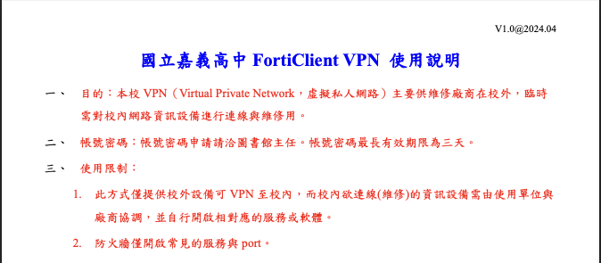
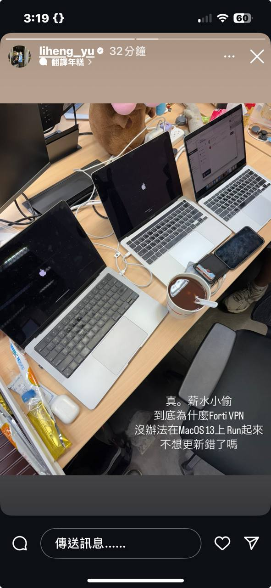
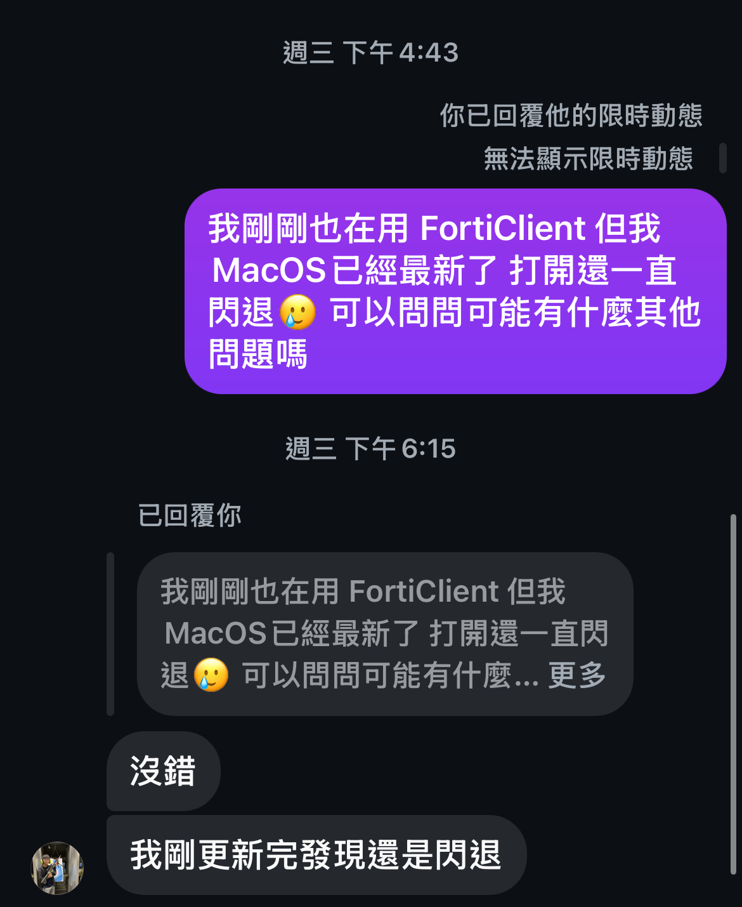
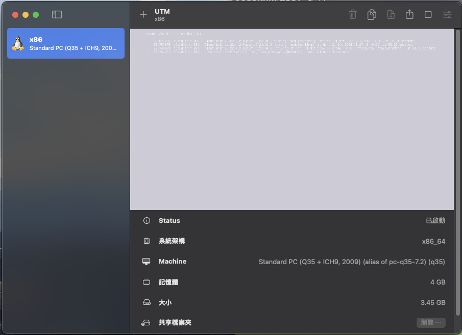
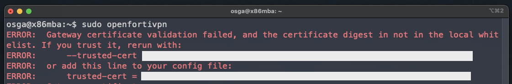
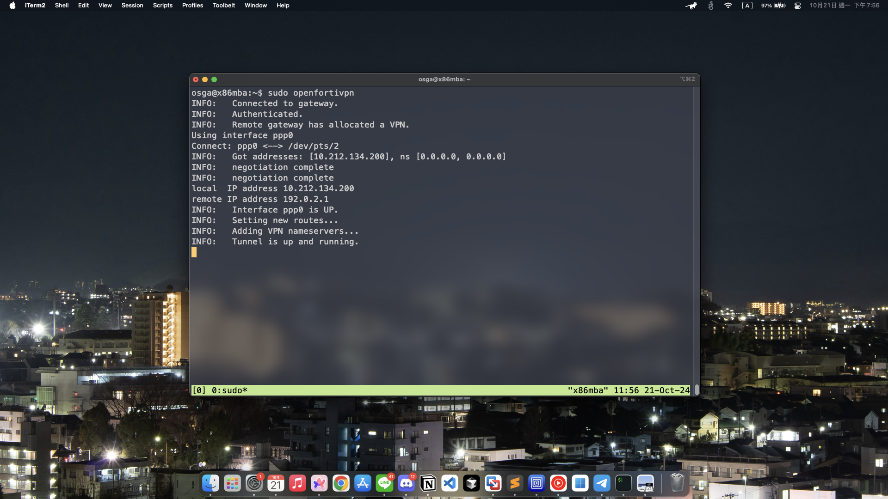

這篇會解釋我在 Macs 上使用 FortiClientVPN 的痛苦經歷

# 前言

一開始是因為之後要去 __嘉義高中__ 擔任資訊研究社的資安社師。
因為之前已經去過他們學校講過一次課了，了解他們的網路環境 __不是那麼簡單__，
所以他們這次社團老師（我之前高職很好的老師）希望我直接將日後課程的靶機架設在他們的學校內

他們學校使用的 VPN 是此文的 FortiClientVPN

他們提供的教學文件是用 Windows 作為示範，但沒關係，因為官網有提供 Mac 的載點


但有趣的事情就發生了，在你載下後他會瘋狂閃退，完全無法使用

這時剛好看到國手也同時發了這篇現動w

但我的筆電最新版的 MacOS Sequoia 也有相同問題


所以問問國手有什麼其他的替代方案，謝謝國手提醒眼殘的我還有 Linux 可以用:D

但當我載到虛擬機才發現他沒有特別出 ARM 架構ㄉ QQ

所以目前就剩兩條路走

- RDP 到其他 x86 Linux 上在連 VPN
    - 可能問題： VPN 互相卡到 瘋狂套娃
- 直接在本機模擬 x86
    - 我真的需要換筆電了 RAM 不夠用🥲

當然，想像你要套一層 VPN 連到另一台機器就只為了連另一個 VPN，當中只要有一條 GG 那全部就完蛋ㄌ

所以最好還是在本機上運行，於是我最後使用 `UTM` 運行 `Ubuntu 20.04 Server`

:::note
為什麼不跑 GUI ？因為我電腦承受不住
:::



# 環境介紹
- MacBook
    - M2 (ARM)
    - MacOS Sequoia
- UTM
    - x86
    - Ubuntu 20.04

:::note
這邊不多做解釋如何在 M 系列晶片安裝 x86 環境
如果有人需要可以私訊我 感謝 Ricky 支援 :D
:::

# 設置 & 安裝教學

這邊不多說我前面為了裝進我的 Linux 又發生了什麼事

反正網站上的載點 "疑似" 只適合用於 GUI （我沒測試過，在 CLI 運行會一直跳出驗證失敗）

所以後面是使用 `openfortivpn`

```bash
sudo apt install openfortivpn
```

接著你可以到 `/etc/openfortivpn/config` 設定好 config

這樣每次需要使用只需要輸入 `openfortivpn` 就好，不需每次都輸入參數

> `/etc/openfortivpn/config`
```
host = 你的 host
port = 就...開在哪個 port 啊
username = 跟前面一樣
password = 很安全的密碼
trusted-cert = 憑證 如何取得會提到 第一次設定可以先忽略
```

好了，當你設定完基本 config ，可以直接輸入 `openfortivpn` 連線

如果跳出這行的話代表你還沒設定憑證

看你取得方式是什麼，~~反正我是用報錯法~~


將憑證加入到 `/etc/openfortivpn/config` 即可

再跑一次 

```bash
sudo openfortivpn
```
就成功連上了


之後再用虛擬機去 `ssh` 就好w

:::tip
因為本人平成不太會需要用到 FortiClientVPN 這次第一次遇到問題

如果有更好的解決辦法或哪裡有錯再麻煩私訊糾正我 ><!

提供給跟我一樣有這方面問題的朋友參考文章~
:::

**=====更=====**

現在是 11/3 號，CGGC 最後一天

前幾天準備要開打剛好看到去年的限動，忽然想起來 CGGC 也是用 `FortiClinet`

原本擔心看不到 CTFd 的我


發現主辦方有給安裝檔啦 :D


~~所以 Mac 問題解決了 小丑是我 🤡 ~~
