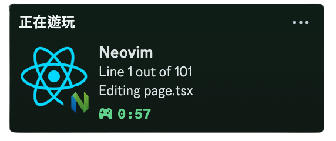

# 前言
如圖效果一樣，之前在使用 VSCode 時，可以將現在在寫的專案顯示在 Discord 的狀態上

但至從升上大學以後幾乎都習慣使用 Vim （甚至不會用 VSCode 了）

所以想說是否也有想同的 plugin 可以使用

# 環境介紹
- MacOS Sequoia
- LunarVim


# 關於
## Discord Presence
Discord Presence 是 Discord 提供的一項功能，允許外部應用程式（例如遊戲、編輯器、音樂播放器等）顯示它們的當前狀態在 Discord 用戶的個人資料上。這不僅能顯示你正在做什麼，還能讓其他人看到你在做什麼，並且能夠直接與你互動。

## presence.nvim
presence.nvim 是一個用於在 Neovim 中啟用 Discord Rich Presence 的插件。它使得當你在 Neovim 中工作時，可以顯示你當前的編輯狀態、文件名和其他自定義文本，並讓其他人看到你在 Discord 上的狀態，從而提升你的工作和社交互動體驗。


# 設定

> `config.lua`
```lua
lvim.plugins = {
  {
    "andweeb/presence.nvim",
    config = function()
      require("presence").setup({
        -- 自訂配置
        neovim_image_text = "LunarVim: The IDE-like Vim",
        main_image = "file", -- 顯示的主圖像 (file, neovim, 或 custom)
        log_level = "debug", -- 可選: 調試時可用
        enable_line_number = true, -- 顯示當前行數
        editing_text = "Editing %s",
        file_explorer_text = "Browsing %s",
        workspace_text = "Working on %s",
        client_text = "Using LunarVim",
      })
    end,
  },
}

```

Discord 必須為軟體，網頁會讀取不到

此外記得開啟活動隱私中的 `與其他人分享您偵測到的活動`

> `demo.png`


如果沒有效果可以嘗試重進lvim 以及確認插件已載入`LvimSync`


# 結語
在我開始嘗試使用終端進行我大多的開發動作，我使用了很多不錯的工具

以下為我的 dotflie，之後也會持續分享套件及工具，順便做記錄
::github{repo="osga24/dotfile"}
