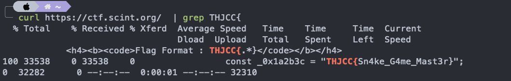
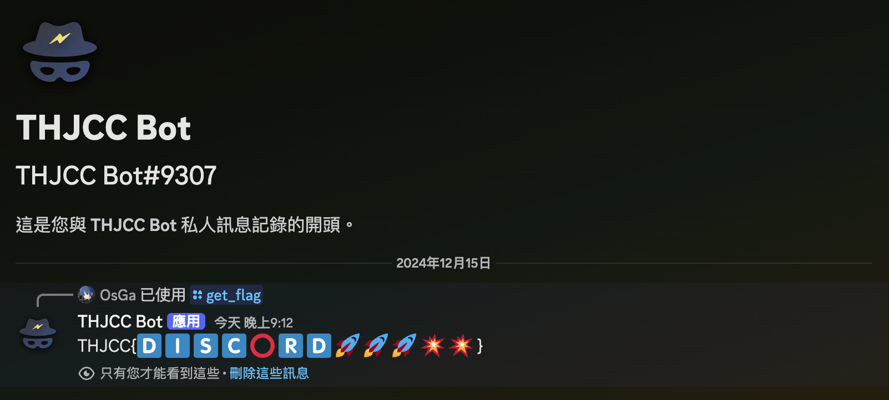

# 前言: 
這次因為大學比較忙，加上大家的想法都很多！所以只負責了兩題最水的  Welcome ，希望有給各位爽到分～也辛苦各位出題者還有Ｃ全場的 Leader 們QQ，也謝謝各位有來參加這次 Winter

雖然說我的題目好像簡單到不用寫 Writeup，但還是來寫一下好ㄌ XD

如果有非預期解的歡迎來跟我分享！

# Wirteup
## welcome
### Welcome 0x2:
> 歡迎來到 THJCC ，這次的 welcome 沒有像上次一樣簡單， 我準備了一個小遊戲，相信你剛剛進來網頁也有看到，
> 
> 沒錯！你必須在主頁的小遊戲達到 10000 分就可以獲得 FLAG！趕快去挑戰！！
> 
> Welcome to THJCC! This time, the 'welcome' isn’t as simple as last time. I’ve prepared a little game for you. I’m sure you saw it when you entered the webpage. That’s right! You need to score 10000 points in the game on the homepage to get the FLAG! Hurry up and take on the challenge!
> 
> `Author: OsGa、Mouchi`

這次搞了個小遊戲出來，謝謝麻糬開賽前幫我優化了它，真的超厲害！

這題禁用了 F12 和任何你可以直接用網頁看到 source code 的方法

但是除了 `view-source`

預期解是直接加上 `view-source:` 看到前端放的 FLAG

或是用 `curl` 都算是預期內解法

:::note
敲敲話：當初想說出一款遊戲可以讓被題目折磨的參賽者可以休閒一下 XD
:::

### Discord 0x2:
> 使用 get_flag 指令獲取 FLAG，對相信我
> 
> Use the get_flag command to retrieve the FLAG, trust me.
> 
> `Author : OsGa`

當初原本想出一題 Discord Bot RCE，礙於技術上問題加上我技術不夠熟練還有事情爆多沒時間的加成上最終放棄

就簡單出一個打 `/get_flag` 就會有 FLAG 的題目

還貼心提醒如果怕機器人回傳的話可以改用私訊

結果發現超多人直接打 `get_flag` 在普通的文字頻道沒加上 `/`

成了另一種效果了（？

