# 前言:
這次幫忙負責了兩題，分別為 `[Welcome]` 的 `CATCH THE FLAG!` ，以及 `[Web]` 的 `Vinci Code online 🛜`

題外話w，剛好季中賽時間卡到了 EOF ，原本 `CATCH THE FLAG!` 出更難，突然想到他是 `[Welcome]` 所以趕回飯店又修簡單一點XD，但最後還是被說太難了:(


# Writeup

## [Welcome] CATCH THE FLAG!
> 嗨你好我是 OsGa
> 
> 預祝各位季中賽順利，我和 Fearnot 去打 EOF 了
> 
> 記得要乖乖不要壞壞ㄡ
> 
> FLAG 被我放在首頁的一個的地方，快去找找看ㄅ
> 
> `Author : OsGa`


`⛩️ HINT1. 先從首頁 https://mid.ctf.scist.org/ 開始`

`⛩️ HINT2. part2 flag in 🤖🤖🤖`

這題就是考一個很簡單的 Web Code Review

先到主頁檢查網頁


其實他會直接出現在 console
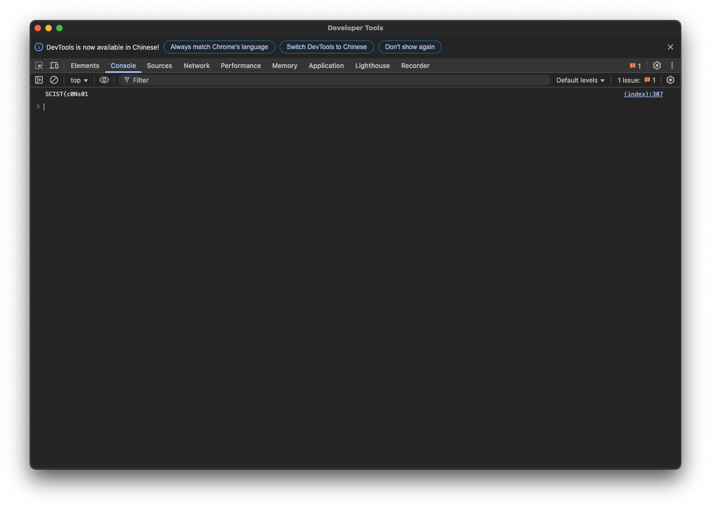

但你也可以直接從 view source code 篩選出前半段的 FLAG
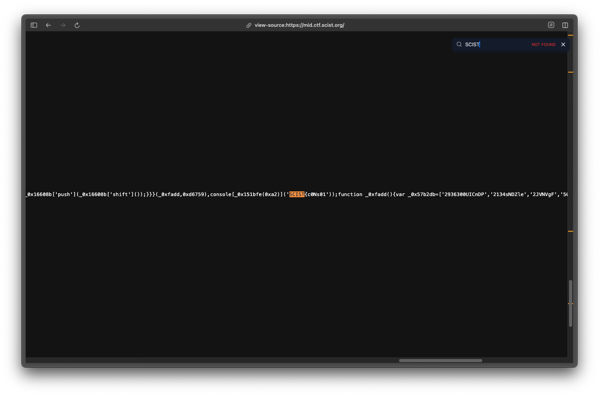


後半段的路徑在 `robots.txt` 裡


喔對 路徑是有 base64 過的，但那不是 FLAG ，要自行切到該 page
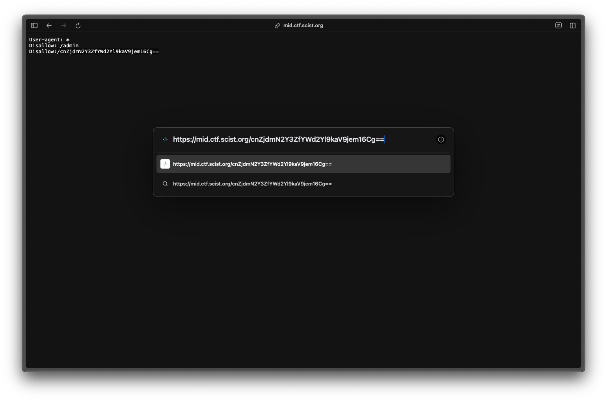

盡到該頁面會看到一顆按鈕，然後跑很快不管怎麼點都很難點，另外 F12 和一些可以開 Devtools 或 Source code 的 hotkey 都被禁掉了。
這是想考個為怎麼用其他方式 bypass 這些黑名單。 
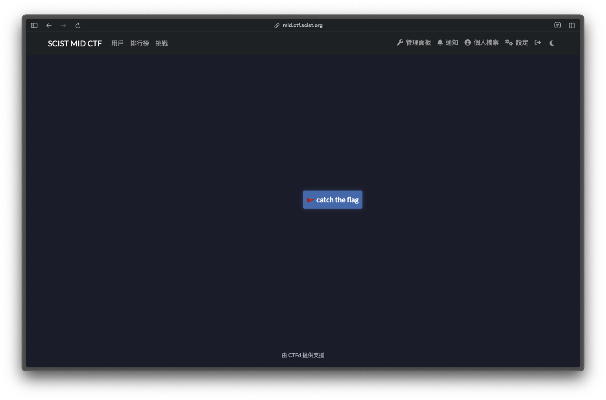

### 以下是幾個預期解：

- 使用瀏覽器自身控制開啟 Devtools ，然後找到按鈕 id ，用 `document.getElementById('flag').click();` 觸發。
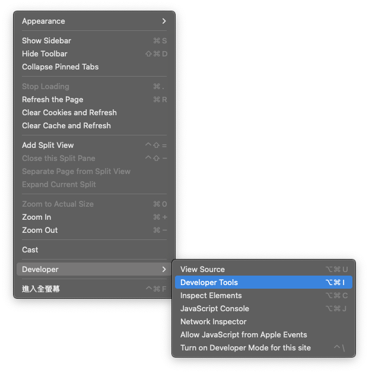
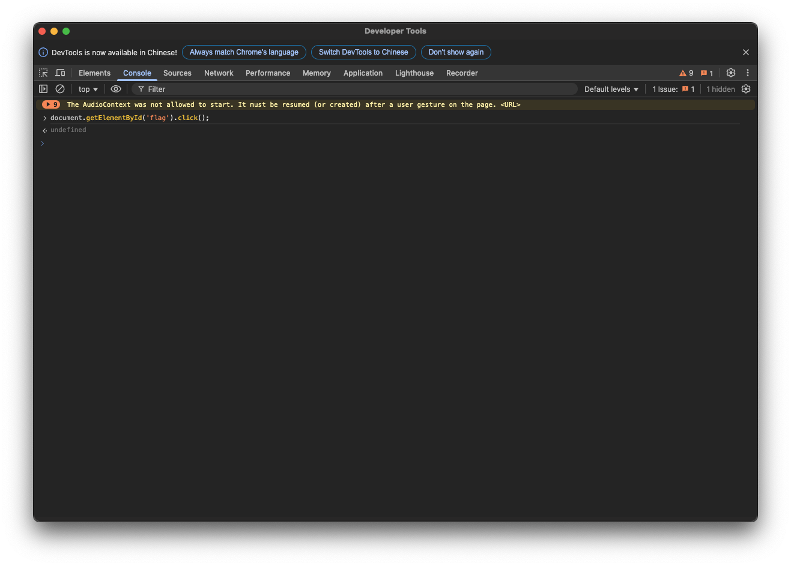
- URL 前面加上 `View-Source` 查看網頁原始碼的 script
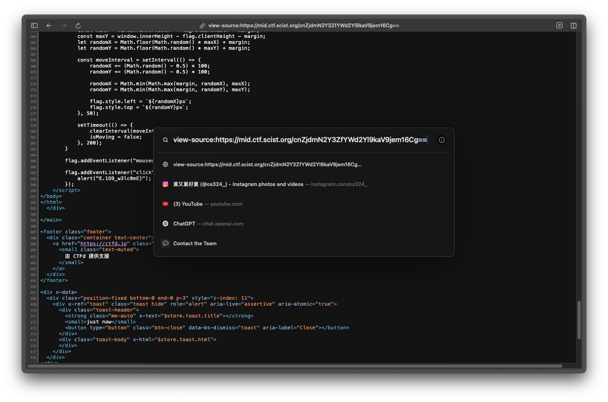

- 用 tab 鍵選取到按鈕並且觸發
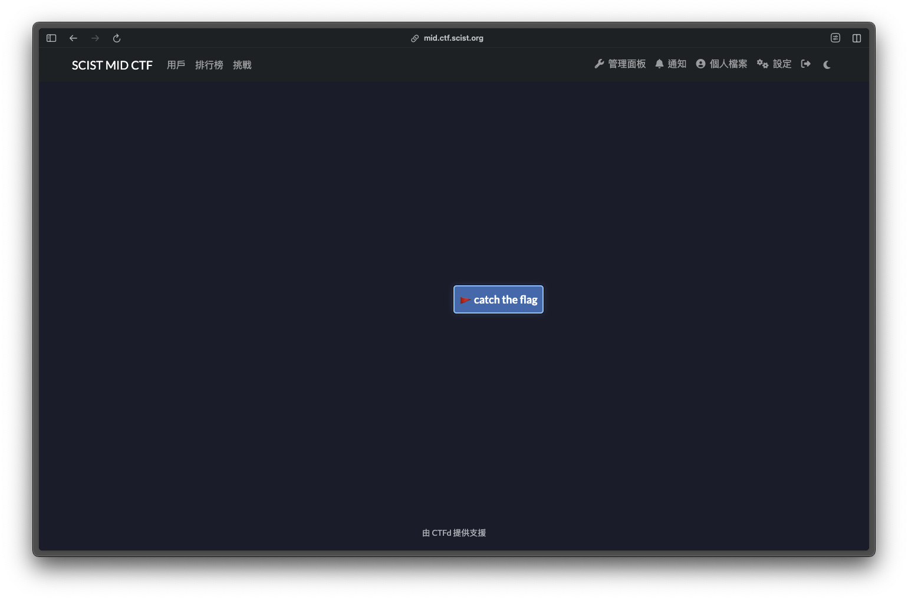


## [Web] Vinci Code online 🛜
這題也是想考 Code Review ，因為剛好那陣子有幫 SCIST 寒訓寫一個活動計分版，那時候有研究了下 WebSocket ，想到可以來簡單出一下

這是一個猜數字的網站，只有三次機會，Range 0~10000，就是希望你去找問題不是盲猜w
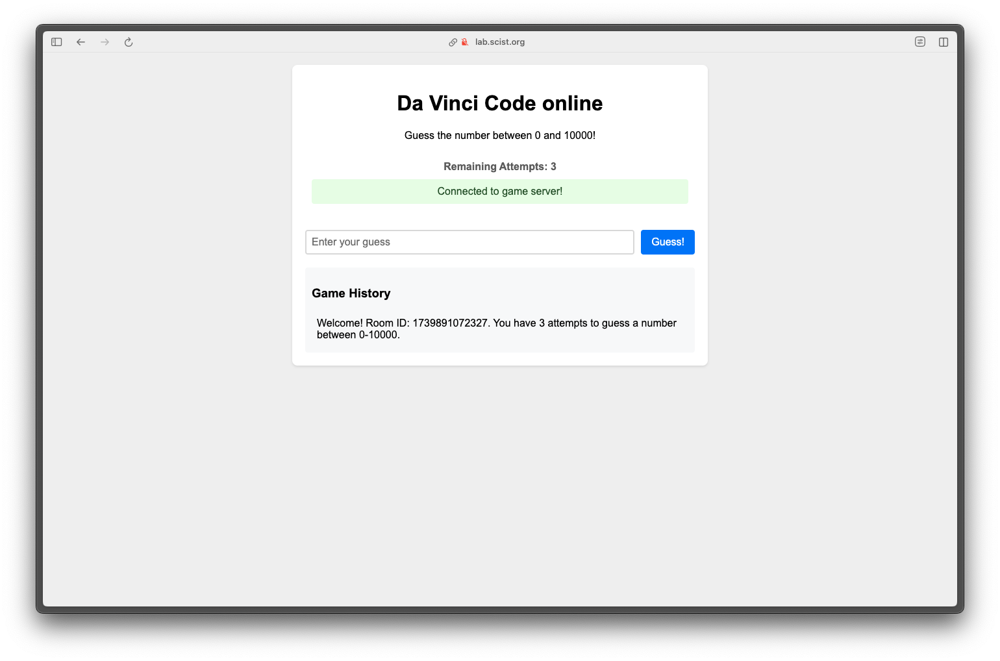

題目有提供兩個後端的 JS ，可以在裡面發現有後門

在 `index.js` 裡可以發現有一個 type 叫 `backdoor`
```js
if (data.type === 'guess') {
    response = room.gameRoom.guess(data.number);
} else if (data.type === 'backdoor') {
    response = room.gameRoom.getSecretAnswer(data.command);
} else {
    response = { status: 'error', message: 'Invalid message type' };
}
```

到 `gameRoom.js` 可以看到怎麼呼叫他
```js 
getSecretAnswer(command) {
    if (command === 'SHOW_ME_THE_ANSWER_PLZ') {
        return { status: 'secret', answer: this.answer };
    }
}
    return { status: 'error', message: 'Invalid command' };
```

### 兩個預期解
- 透過 `wscat` 發送 `WebSocket` 請求
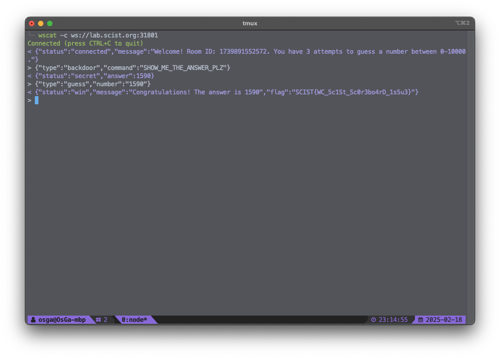

- 用 burp 攔截然後改請求，之後直接將答案輸入在網頁上

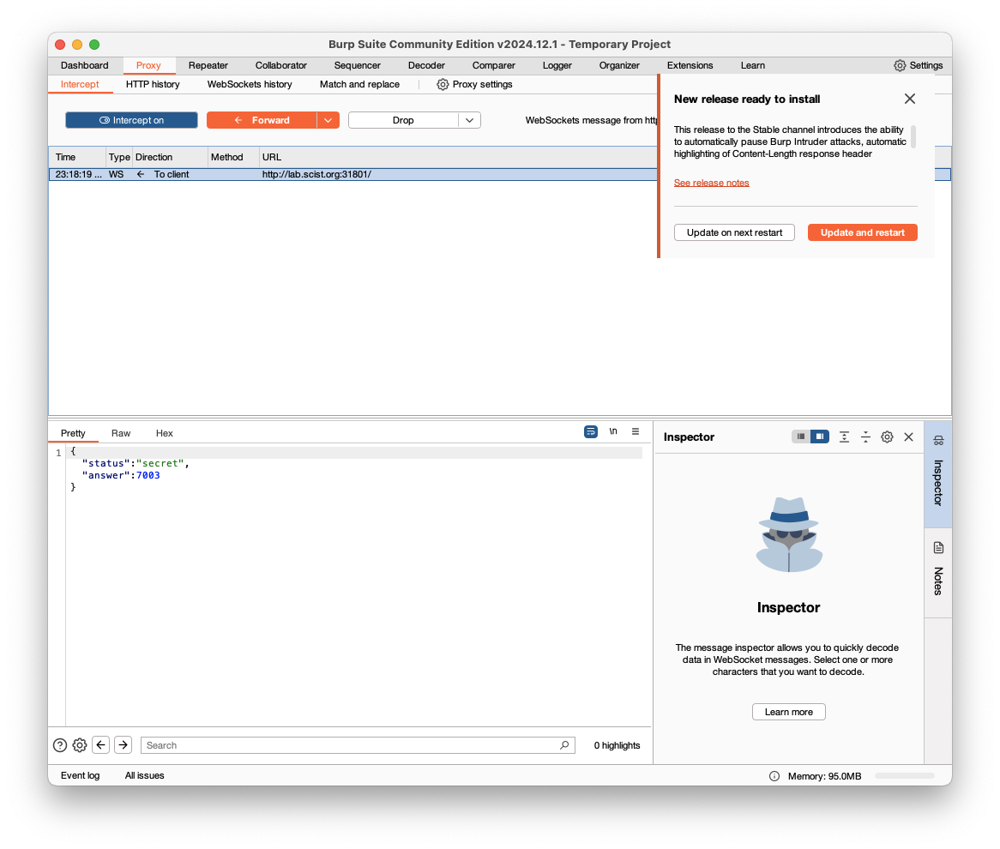
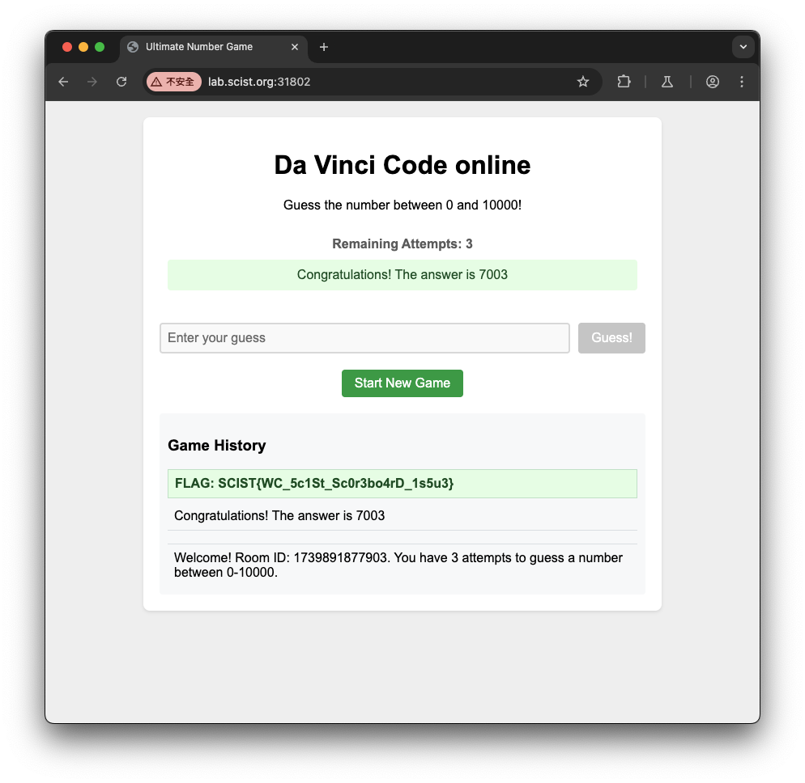


以上就是這次季中賽的題解，感謝各位參與，祝福各位都能參與下學期社課並持續在資安這條路前進，季末賽見。
如有任合問題歡迎到 DC 開單或私訊詢問我！
